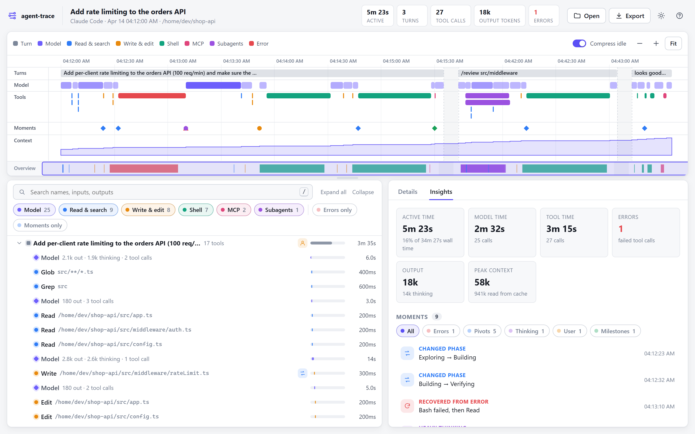
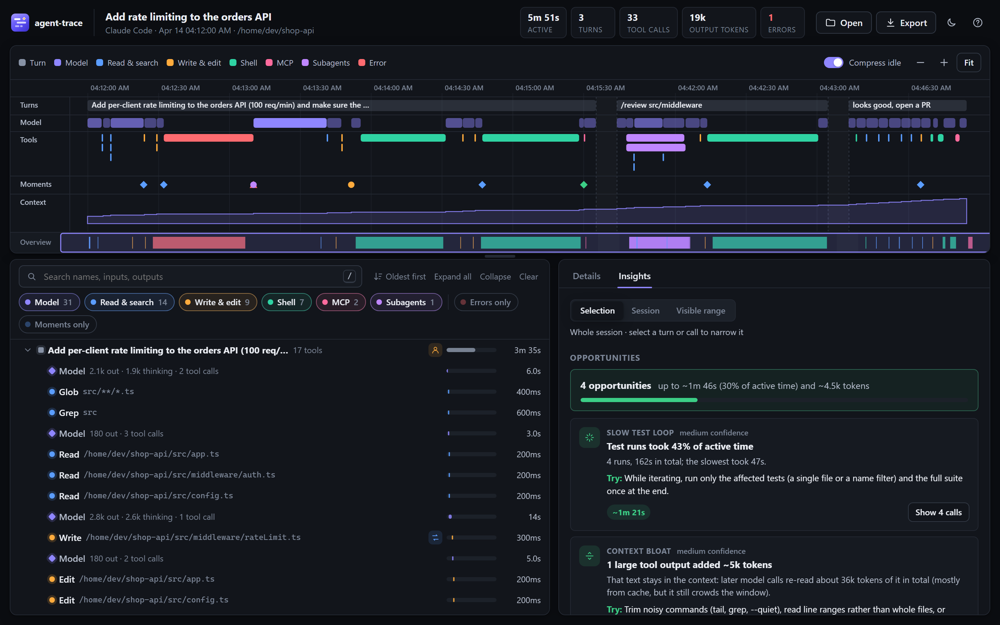

<p align="center">
  
</p>

<h1 align="center">agent-trace</h1>

<p align="center">
  <b>See what your AI agent actually did, and where it could do better.</b><br>
  An interactive timeline, call tree and savings report for Claude Code sessions and OpenTelemetry traces, in one self-contained HTML file.
</p>

<p align="center">
  <a href="https://github.com/jrootr/agent-trace/actions/workflows/ci.yml"></a>
  
  
  <a href="https://www.npmjs.com/package/@jrootr/agent-trace"></a>
  
  
  
  <a href="LICENSE"></a>
</p>



<details><summary>Dark theme</summary>



</details>

The screenshots show [`examples/demo-session.jsonl`](examples/demo-session.jsonl), a synthetic session. Open [`examples/demo.html`](examples/demo.html) in a browser to click around with nothing installed.

## Why

An agent session is hundreds of model calls and tool calls. Reading the transcript tells you *what* happened. agent-trace shows you:
- **how** it unfolded: timing, parallelism, retries, subagents, context growth
- **where it turned**: errors, pivots, heavy thinking, moments you stepped in
- **what to change** so the next run is faster and cheaper, with the exact calls as evidence

## Features

### Opportunities: actionable savings
The Insights tab ranks concrete improvements, each with:
- an estimated gain in time and tokens
- a confidence level
- a **Try:** action
- a **Show calls** button that highlights the evidence in the tree and the timeline

| Detector | Pattern | Typical fix |
|---|---|---|
| Redundant reads | The same file, search or fetch repeated, with nothing changed in between | Point the agent at what changed; use targeted reads |
| Repeated failures | The same call failing again | Write the fix into project instructions (CLAUDE.md) |
| One-at-a-time lookups | Chains of independent reads, one per model round trip | Ask for related reads together, so they run in parallel |
| Context bloat | Huge tool outputs that every later call carries | Trim noisy commands; read line ranges |
| Cache expired | A long break, then the whole context re-processed | Fresh session or compact before a new task |
| Slow test loop | Test runs dominating active time | Run affected tests while iterating, the full suite at the end |
| Edit churn | Many small edits to one file in one turn | Describe the whole change up front |
| Repeated routine | The same multi-step sequence across turns | Turn it into a script, slash command or skill |

The estimates are deliberately simple and labeled as such:
- a saved round trip counts as a typical model call in the current scope
- text counts as ~4 characters per token

### Understand the run
- **Timeline.** Lanes for turns, model calls (shaded by thinking), tools (colored by category, parallel calls stacked), moments, and context size.
  - Scroll to zoom, drag to pan, double-click to zoom to a span.
  - Long idle stretches are squeezed so the activity stays readable.
- **Call tree.** Turns → model calls → tool calls → subagents, with a mini-bar showing where each call sits in its turn.
  - Toggle **oldest / newest first** (`o`), applied at every level.
  - It's virtualized, so 40,000+ spans stay smooth.
- **Details.** Prompt, response, tool input and output (copyable), errors, the token breakdown (cache read / write / fresh, thinking / visible), and breadcrumbs to ancestors.
- **Insights, scoped to what you're looking at.** They follow your **selection** (a turn or subagent), the **whole session**, or the **visible timeline range**, and update as you click and zoom. They include:
  - **Opportunities**
  - **Story:** the agent's own messages interleaved with moments, as an overview of its reasoning
  - **where the time went:** model / tools / waiting
  - **slowest calls**, **moments**, and a **tools table**
- **Moments.** Inferred turning points, because raw reasoning text usually isn't stored:
  - recovered, retried or unresolved errors
  - phase pivots (exploring → building → verifying)
  - heavy thinking
  - you steering or interrupting
  - milestones and context compactions

  Jump between them with `[` and `]`.
- **Search and filters.** Full-text search, category chips (**Shift+click** a chip to show only that category), *errors only*, *moments only*, and **Clear** (`c`).
- **Light and dark** themes that follow your system, with a toggle (`t`) and a `?theme=dark` URL parameter. Press `?` in the viewer for all shortcuts.

## Install

Requires **Node.js 18.17 or newer**. There are no dependencies.

```bash
npx @jrootr/agent-trace view            # run it once, nothing to install

npm install -g @jrootr/agent-trace      # or install the `agent-trace` command
agent-trace view
```

To run from source, clone it and `npm link`:

```bash
git clone https://github.com/jrootr/agent-trace.git
cd agent-trace && npm link
```

No CLI at all? Download `agent-trace.html` from the [latest release](https://github.com/jrootr/agent-trace/releases), or use `dist/agent-trace.html`. Open it in a browser and drop a trace file onto it.

| Node.js | Status |
|---|---|
| 24 (LTS) | ✅ recommended, tested in CI |
| 22 (LTS) | ✅ tested in CI |
| 20 | ✅ tested in CI (end-of-life upstream) |
| 18.17+ | ✅ tested in CI (end-of-life upstream) |

CI runs every version on Linux, macOS and Windows.

## CLI

```text
agent-trace view   [target] [--out FILE] [--no-open]     self-contained HTML report, opened in your browser
agent-trace list   [--limit N] [--json]                  recent Claude Code sessions
agent-trace stats  [target] [--json]                     summary + moments in the terminal
agent-trace export [target] --format otlp|trace [--out FILE]
agent-trace send   [target] --endpoint URL [--header "Name: value"]...
agent-trace build                                        rebuild dist/agent-trace.html
```

A `target` can be:
- a `.jsonl` transcript
- an OTLP/JSON file
- an exported `agent-trace` JSON file
- a directory
- a Claude Code **session id**, or the first few characters of one

Leave it out to use your most recent session. Subagent transcripts (`<session>/subagents/*.jsonl`) are merged in automatically.

| Option | Effect |
|---|---|
| `--no-redact` | Keep values that look like secrets. By default these are redacted: API keys, GitHub/Slack/AWS/npm tokens, JWTs, bearer headers, private keys, and arguments named like `password`/`token`/`apiKey`. |
| `--no-io` | Structure and timing only: no prompts, outputs or tool inputs. Use it before sharing a report. |
| `--max-io N` | Characters kept per input/output (default 20,000). |

Claude Code transcripts live in `~/.claude/projects/<project>/<session-id>.jsonl`. Set `AGENT_TRACE_CLAUDE_DIR` to look elsewhere.

## OpenTelemetry

agent-trace is pluggable in both directions.

**Export.** `agent-trace export --format otlp` writes OTLP/JSON following the OpenTelemetry GenAI semantic conventions:

| agent-trace span | OTel span name | Key attributes |
|---|---|---|
| model call | `chat <model>` (CLIENT) | `gen_ai.operation.name=chat`, `gen_ai.request.model`, `gen_ai.usage.input_tokens`, `gen_ai.usage.output_tokens`, `gen_ai.response.finish_reasons` |
| tool call | `execute_tool <tool>` (CLIENT) | `gen_ai.operation.name=execute_tool`, `gen_ai.tool.name`, `gen_ai.tool.call.id` |
| turn / subagent | the prompt / task | `gen_ai.operation.name=invoke_agent`, `gen_ai.conversation.id` |

- Everything else is kept under `agent_trace.*`.
- Errors set span status `ERROR`.
- Moments and interjections become span events.
- The round trip is lossless.

**Send** to any OTLP/HTTP collector:

```bash
docker run --rm -p 16686:16686 -p 4318:4318 jaegertracing/all-in-one
agent-trace send --endpoint http://localhost:4318      # then open http://localhost:16686
```

Langfuse, Phoenix, Tempo and vendor collectors work the same way. Pass `--header "Authorization: …"`.

**Import.** Drop any OTLP/JSON export onto the viewer, or pass it to the CLI.
- GenAI spans show up as model and tool calls with token counts.
- Other spans still appear on the timeline and in the tree.
- Multi-trace files get a picker.

## Library

```js
import { parseAny, findOpportunities, findInflections, toOtlp } from '@jrootr/agent-trace';

const { traces: [trace] } = parseAny(fs.readFileSync('session.jsonl', 'utf8'));
for (const o of findOpportunities(trace)) console.log(o.title, o.impact, o.action);
```

Add a format with `registerAdapter({ id, label, detect(text), parse(text) → Trace[] })`. See [How it works](#how-it-works).

## How it works

```
 Claude Code .jsonl ─┐                        ┌─► viewer (one HTML file: canvas timeline, virtual tree,
 OTLP/JSON ──────────┼─► adapters ─► Trace ───┤      details, scoped insights, opportunities)
 agent-trace JSON ───┘   (registry)  (sanitized) ├─► analysis: moments, stats, opportunities
 your format ────────────►                    └─► OTLP export / send
```

- **Model** (`src/core/model.mjs`). A `Trace` is spans plus instant events:
  - spans have `id`, `parentId`, `kind` (`session`/`turn`/`llm`/`tool`/`agent`/`span`), `name`, `start`, `end`, `status`, `attrs`, and optional `input`/`output`
  - the model mirrors OpenTelemetry spans, so OTLP is a direct mapping
- **Claude Code adapter.**
  - groups content blocks into API messages by `message.id` and counts usage once
  - times model calls from the previous event to their last block, and tools from `tool_use` to `tool_result`
  - treats messages sent mid-turn as *interjections*
  - nests subagent sidechains under their `Agent` call
- **Analysis** (`src/core/analysis.mjs`, `src/core/opportunities.mjs`). Plain functions over a trace or a slice of one (subtree or time window). They're the same code the viewer and the library use.
- **Viewer** (`src/viewer/`). Plain ES modules with no framework:
  - inlined by a small, rule-checking bundler into `dist/agent-trace.html`
  - the CLI embeds the trace as JSON in the same template
  - the timeline is one `<canvas>`; bars that share a pixel are coalesced and the overview is cached, so redraws fit in a frame
  - a piecewise-linear time scale squeezes idle gaps; the tree only renders visible rows

**Performance**, measured on a laptop with a synthetic 20,000-tool-call session (41k spans, a 16 MB transcript):

| Step | Time |
|---|---|
| Parse | ~180 ms |
| Analysis | ~50 ms |
| Load in browser | ~1 s |
| Zoom/pan redraw | within one frame |
| JS heap | ~26 MB |

`test/perf.test.mjs` guards this.

## Security and privacy

Trace files can contain prompts, code and credentials, and reports get shared, so agent-trace treats every trace as untrusted:

- **Locked-down reports.** Each generated HTML file carries a Content-Security-Policy that:
  - runs only its own script, pinned by SHA-256 hash
  - forbids all network access, so a report can't send its contents anywhere
- **Escaped and normalized input.** All trace text is escaped. Fields that reach markup structure are forced to known values. Hostile traces are part of the test suite.
- **Redaction by default** for secrets, plus `--no-io` for structure-only reports.
- **Local by default.** The only network call is `send`, to the endpoint you name.
- **No runtime dependencies.** CI runs `npm audit`, a secret scan, and (once the repo is public) CodeQL.

Report vulnerabilities privately: see [SECURITY.md](SECURITY.md).

## Development

```bash
npm run check      # build + lint + tests: what CI runs
npm run coverage   # tests with a coverage table
npm run badges     # refresh the README test/coverage badges
node scripts/make-demo.mjs            # regenerate examples/demo-session.jsonl
node scripts/make-large-fixture.mjs   # big synthetic session for perf work
```

There are 60 tests, run with `node:test` and no dependencies. They cover:
- adapters, moments, opportunities, scoping and stats
- the OTLP round trip, plus import from foreign GenAI apps
- the CLI end to end, including a real HTTP collector
- the bundler, including hostile embedded data
- the security properties above, and a 20k-call performance guard

The canvas and DOM wiring are verified by hand in a browser, so the coverage figure covers the logic modules. Browser UI tests are on the roadmap.

See [CONTRIBUTING.md](CONTRIBUTING.md) for the bundler rules and the release process.

## Versioning and releases

agent-trace follows [Semantic Versioning](https://semver.org), and every change is recorded in [CHANGELOG.md](CHANGELOG.md):
- **patch** for fixes
- **minor** for new features
- **major** for breaking changes (while on 0.x, minor releases may also break things, and the changelog says so)

### Releasing a new version

1. Under `## [Unreleased]` in `CHANGELOG.md`, list what changed. Commit it.
2. From a clean working tree on `main`:

   ```bash
   npm version minor            # or: patch | major
   git push --follow-tags
   ```

That's all.
- **`npm version`** bumps `package.json`, turns *Unreleased* into a dated section, rebuilds `dist/`, commits, and tags `vX.Y.Z`.
- **The tag push** runs the [release workflow](.github/workflows/release.yml), which:
  1. checks that the tag matches `package.json`
  2. runs build, lint and tests
  3. creates a **GitHub release** with notes from the changelog and the standalone `agent-trace.html` attached
  4. **publishes to npm**

npm publishing uses [trusted publishing](https://docs.npmjs.com/trusted-publishers): npm trusts this repository's `release.yml` through OpenID Connect, so no npm token is stored anywhere. Every version gets a provenance attestation linking it to the commit and workflow run that built it.

To re-run a release, for example if a step failed, open **Actions → Release → Run workflow** and enter the existing tag. Steps that already succeeded are skipped: a GitHub release that exists is left alone, and a version already on npm isn't published again.

Optionally, before releasing, `npm run badges` refreshes the test and coverage badges.

## Roadmap

| Done | Next (size) |
|---|---|
| ✅ Claude Code + OTLP adapters, lossless OTLP round trip | **GitHub Copilot adapter** (S): hook logs → traces |
| ✅ Timeline, call tree, drill-down, moments | **Live mode** (M): `view --watch` tails a running session |
| ✅ Scoped insights, story, opportunities with evidence | **Flame graph by tokens** (M): what fills the context |
| ✅ CLI: view, list, stats, export, send | **Trace diff** (M): two runs of the same task side by side |
| ✅ CSP-locked reports, sanitization, redaction | **Browser UI tests** (M): Playwright smoke tests |
| ✅ CI on 3 OSes × 4 Node versions, semver releases | **More importers** (S each): LangSmith, Langfuse, OpenAI Agents SDK, OTLP protobuf |
| ✅ Published to npm with trusted publishing + provenance | |

## License

MIT. See [LICENSE](LICENSE).
